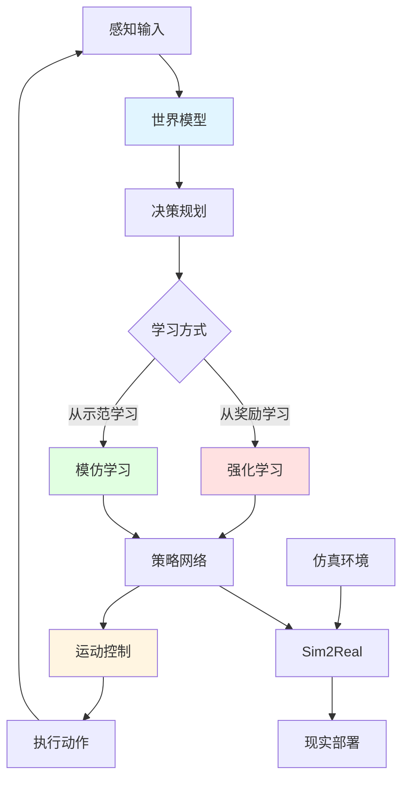

# 03 核心技术

> 物理AI / 具身智能核心技术模块

本目录深入介绍物理AI领域的核心技术，涵盖机器人学习、决策与控制的各个方面。

---

## 📋 目录结构

```
03_核心技术/
├── README.md           # 本文件
├── 强化学习基础/        # Reinforcement Learning
├── 模仿学习/           # Imitation Learning  
├── 世界模型/           # World Models
├── Sim2Real/           # 仿真到现实迁移
└── 运动控制/           # Motion Control
```

---

## 🧠 核心技术概览

### 技术架构图

```
┌─────────────────────────────────────────────────────────────────┐
│                    物理AI核心技术栈                              │
├─────────────────────────────────────────────────────────────────┤
│                                                                 │
│   ┌──────────────┐    ┌──────────────┐    ┌──────────────┐     │
│   │   感知层      │    │   决策层      │    │   控制层      │     │
│   │ Perception   │    │  Decision    │    │  Control     │     │
│   └──────┬───────┘    └──────┬───────┘    └──────┬───────┘     │
│          │                   │                   │              │
│          ▼                   ▼                   ▼              │
│   ┌──────────────────────────────────────────────────────┐     │
│   │                    世界模型 World Model               │     │
│   │           环境理解 | 状态预测 | 规划想象               │     │
│   └──────────────────────────────────────────────────────┘     │
│          │                   │                   │              │
│          ▼                   ▼                   ▼              │
│   ┌──────────────┐    ┌──────────────┐    ┌──────────────┐     │
│   │  强化学习     │    │  模仿学习     │    │  运动控制     │     │
│   │     RL       │    │     IL       │    │  MPC/WBC     │     │
│   └──────────────┘    └──────────────┘    └──────────────┘     │
│          │                   │                   │              │
│          └───────────────────┼───────────────────┘              │
│                              ▼                                  │
│                    ┌──────────────┐                             │
│                    │   Sim2Real   │                             │
│                    │  仿真到现实   │                             │
│                    └──────────────┘                             │
│                                                                 │
└─────────────────────────────────────────────────────────────────┘
```

---

## 📚 子模块介绍

### 1. [强化学习基础](./强化学习基础/)
强化学习是机器人通过与环境交互学习最优策略的核心技术。

**主要内容：**
- MDP（马尔可夫决策过程）基础
- Value-based 方法（DQN、Double DQN）
- Policy-based 方法（REINFORCE、PPO）
- Actor-Critic 方法（A2C、SAC、TD3）
- 多智能体强化学习

### 2. [模仿学习](./模仿学习/)
模仿学习让机器人从人类示范中学习行为策略。

**主要内容：**
- 行为克隆（Behavior Cloning）
- DAgger（数据聚合）
- GAIL（生成对抗模仿学习）
- 逆强化学习（IRL）

### 3. [世界模型](./世界模型/)
世界模型使机器人能够预测环境动态，进行规划。

**主要内容：**
- 状态空间模型（SSM）
- World Models（Ha & Schmidhuber）
- Dreamer 系列（DreamerV1/V2/V3）
- IRIS（基于Transformer的世界模型）
- JEPA架构

### 4. [Sim2Real](./Sim2Real/)
Sim2Real解决仿真到现实的迁移问题。

**主要内容：**
- 域随机化（Domain Randomization）
- 域适应（Domain Adaptation）
- 数字孪生（Digital Twin）
- 系统辨识（System Identification）
- 课程学习（Curriculum Learning）

### 5. [运动控制](./运动控制/)
运动控制实现机器人的精确运动和平衡。

**主要内容：**
- 模型预测控制（MPC）
- 全身控制（WBC）
- 零力矩点（ZMP）
- 逆运动学/逆动力学
- 阻抗/导纳控制

---

## 🔄 技术关联图



---

## 🎯 学习路径建议

### 入门路径（4-6周）
```
1. 强化学习基础（2周）
   └─ MDP → DQN → PPO
   
2. 模仿学习（1周）
   └─ 行为克隆 → DAgger
   
3. 运动控制基础（1周）
   └─ 逆运动学 → 阻抗控制
   
4. Sim2Real入门（1-2周）
   └─ 域随机化 → 仿真训练
```

### 进阶路径（8-12周）
```
1. 深入强化学习（3周）
   └─ SAC → TD3 → 多智能体
   
2. 世界模型（3周）
   └─ VAE → Dreamer → 规划
   
3. 高级运动控制（2周）
   └─ MPC → WBC
   
4. Sim2Real进阶（2-4周）
   └─ 域适应 → 数字孪生
```

---

## 🛠️ 常用框架与工具

| 领域 | 工具/框架 | 说明 |
|------|----------|------|
| 强化学习 | Stable-Baselines3 | RL算法库 |
| 强化学习 | RLlib | 分布式RL |
| 模仿学习 | LeRobot | HuggingFace机器人学习 |
| 世界模型 | Dreamer | DeepMind世界模型 |
| Sim2Real | Isaac Sim | NVIDIA仿真平台 |
| 运动控制 | MuJoCo | 物理仿真引擎 |
| 运动控制 | Pinocchio | 刚体动力学库 |

---

## 📖 推荐资源

### 经典教材
- **Reinforcement Learning: An Introduction** - Sutton & Barto
- **Robotics: Modelling, Planning and Control** - Siciliano

### 在线课程
- [DeepMind RL Course](https://www.deepmind.com/learning-resources)
- [Stanford CS234: RL](http://web.stanford.edu/class/cs234/)

### 开源项目
- [CleanRL](https://github.com/vwxyzjn/cleanrl) - 单文件RL实现
- [SpinningUp](https://github.com/openai/spinningup) - OpenAI RL教程

---

*持续更新中，欢迎贡献！*
